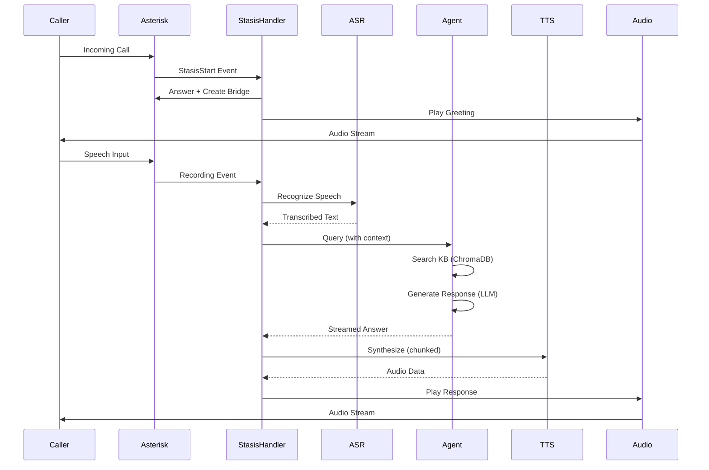

# 📊 ОТЧЕТ ПО АРХИТЕКТУРЕ ПРОЕКТА asterisk-vox-bot

**Дата анализа**: 2025-11-01  
**Версия проекта**: metrotest  
**Анализ выполнен**: Автоматизированный архитектурный аудит

---

## 📋 EXECUTIVE SUMMARY

Проект **asterisk-vox-bot** представляет собой голосового AI-ассистента для обработки входящих звонков через Asterisk PBX с использованием:
- Распознавания речи (Yandex ASR)
- AI-агента с RAG (Retrieval-Augmented Generation) на базе LangChain + ChromaDB
- Синтеза речи (Yandex TTS через HTTP и gRPC)
- Веб-интерфейса для мониторинга и управления

**Общая оценка**: ⭐⭐⭐⭐☆ (4/5)
- ✅ Функционально полная система
- ✅ Хорошая документация
- ✅ Оптимизация производительности выполнена
- ⚠️ Технический долг присутствует
- ⚠️ Требуется рефакторинг некоторых компонентов

---

## 1. АРХИТЕКТУРА СИСТЕМЫ

### 1.1 Общая структура

```
┌─────────────────────────────────────────────────────────────┐
│                    ASTERISK-VOX-BOT SYSTEM                   │
├─────────────────────────────────────────────────────────────┤
│                                                               │
│  ┌──────────────┐      ┌──────────────┐      ┌───────────┐ │
│  │   Asterisk   │──────│ StasisHandler │──────│  FastAPI  │ │
│  │     PBX      │ ARI  │   (Async)     │ REST │  Admin UI │ │
│  └──────────────┘      └──────────────┘      └───────────┘ │
│         │                      │                      │      │
│         │                      ├──────────────────────┤      │
│         │                      │                      │      │
│    ┌────▼─────┐         ┌─────▼──────┐        ┌─────▼────┐ │
│    │  Audio   │         │  Services  │        │ Logs DB  │ │
│    │  Files   │         │ Layer      │        │ SQLite   │ │
│    └──────────┘         └────────────┘        └──────────┘ │
│                               │                              │
│         ┌─────────────────────┼─────────────────┐           │
│         │                     │                 │           │
│    ┌────▼───┐           ┌────▼────┐      ┌────▼────┐       │
│    │ Yandex │           │   AI    │      │  Redis  │       │
│    │  ASR   │           │  Agent  │      │  Cache  │       │
│    │  TTS   │           │  (RAG)  │      │         │       │
│    └────────┘           └─────────┘      └─────────┘       │
│                               │                              │
│                         ┌─────▼──────┐                      │
│                         │  ChromaDB  │                      │
│                         │ (Vectors)  │                      │
│                         └────────────┘                      │
└─────────────────────────────────────────────────────────────┘
```

### 1.2 Ключевые компоненты

#### **1.2.1 Основной обработчик (`stasis_handler_optimized.py`)**
- **Роль**: Центральный узел обработки звонков
- **Размер**: 1594 строк (⚠️ слишком большой)
- **Архитектурный паттерн**: Event-driven architecture
- **Технологии**: asyncio, websockets
- **Зависимости**: 
  - ARI Client (Asterisk REST Interface)
  - AI Agent (RAG)
  - ASR/TTS Services
  - Multiple helper services (11+ классов)

**Оценка**: ⚠️ **Монолитный компонент** - требуется декомпозиция

#### **1.2.2 AI Agent (`agent.py`)**
- **Роль**: RAG-система с dual knowledge base
- **Размер**: 666 строк
- **Паттерн**: Repository + Chain of Responsibility
- **Технологии**: LangChain, ChromaDB, OpenAI
- **Особенности**:
  - Кешированные embeddings (Redis)
  - Двойная база знаний (general + tech)
  - Fallback между базами знаний
  - Hot-reload промптов

**Оценка**: ✅ Хорошо спроектирован

#### **1.2.3 FastAPI Server (`main.py`)**
- **Роль**: REST API + Static UI
- **Размер**: 529 строк
- **Паттерн**: REST API + MVC для UI
- **Endpoints**: 
  - `/logs` - просмотр логов
  - `/kb`, `/kb2` - управление базами знаний
  - `/api/prompts` - управление промптами
  - `/api/settings` - конфигурация
- **Security**: API Key authentication

**Оценка**: ✅ Хорошая организация

#### **1.2.4 Services Layer**
**19 сервисных модулей** (⚠️ избыточное количество):

| Сервис | Назначение | Статус |
|--------|------------|--------|
| `yandex_asr_service.py` | Распознавание речи | ✅ Активен |
| `yandex_tts_service.py` | HTTP TTS | ✅ Активен |
| `yandex_grpc_tts.py` | gRPC TTS (быстрый) | ✅ Активен |
| `tts_adapter.py` | Адаптер с fallback | ✅ Активен |
| `parallel_tts.py` | Параллельная обработка | ✅ Активен |
| `sequential_tts.py` | Последовательная обработка | ⚠️ Дублирование? |
| `filler_tts.py` | Filler words | 🔧 Отключен |
| `barge_in_manager.py` | Управление прерыванием | 🔧 Частично |
| `simple_vad_service.py` | Voice Activity Detection | ⚠️ Опционально |
| `smart_speech_detector.py` | Умная детекция речи | ⚠️ Опционально |
| `speech_filter.py` | Фильтрация речи | ⚠️ Опционально |
| `error_handler.py` | Обработка ошибок | ✅ Активен |
| `performance_monitor.py` | Мониторинг | ✅ Активен |
| `log_storage.py` | SQLite логи | ✅ Активен |
| `asr_service.py` | ASR абстракция | ✅ Активен |
| `tts_service.py` | TTS абстракция | ⚠️ Дублирование? |

**Проблемы**:
1. ⚠️ **Избыточность**: `sequential_tts.py` + `sequential_tts_backup_before_monitoring.py`
2. ⚠️ **Неиспользуемый код**: Filler TTS реализован, но отключен
3. ⚠️ **Сложность**: Слишком много маленьких сервисов

### 1.3 Взаимодействие компонентов



### 1.4 Используемые технологии

#### **Backend Stack**
```python
# Core
Python 3.11
FastAPI (web framework)
uvicorn/gunicorn (ASGI server)

# Async
asyncio (event loop)
websockets (ARI connection)
aiohttp (async HTTP)

# AI/ML
langchain (orchestration)
langchain-openai (LLM/embeddings)
chromadb (vector store)
tiktoken (tokenization)

# Storage
SQLite (logs)
Redis (cache)
ChromaDB (vectors)

# External APIs
Yandex SpeechKit (ASR/TTS)
OpenAI API (LLM/embeddings)
```

#### **Infrastructure**
```bash
# Services
Asterisk 20+ (PBX)
Redis (caching)
systemd (process management)

# Protocols
ARI (Asterisk REST Interface)
WebSocket (real-time events)
gRPC (fast TTS)
HTTP/REST (fallback)
```

---

## 2. ОЦЕНКА ТЕКУЩЕГО СОСТОЯНИЯ

### 2.1 Качество кода

#### ✅ **Сильные стороны**

1. **Async-first архитектура**
   ```python
   # Правильное использование asyncio
   async def handle_stasis_start(self, event):
       async with self.ari_client as client:
           await client.answer_channel(channel_id)
   ```

2. **Логирование**
   - Структурированное логирование
   - Ротация логов
   - Понятные эмодзи-метки (✅, ❌, ⚠️)

3. **Кеширование**
   ```python
   # Redis кеш для embeddings
   class CachedOpenAIEmbeddings(OpenAIEmbeddings):
       def embed_query(self, text: str):
           cache_key = self._get_cache_key(text)
           if cached := redis.get(cache_key):
               return json.loads(cached)
   ```

4. **Error handling**
   - Try-catch блоки
   - Graceful degradation
   - Fallback механизмы

#### ⚠️ **Проблемные области**

1. **Монолитный StasisHandler (1594 строки)**
   ```python
   class OptimizedAsteriskAIHandler:
       # ⚠️ Слишком много ответственности:
       # - Event handling
       # - Audio management
       # - TTS processing
       # - VAD management
       # - Timeout management
       # - Call state management
       # - Logging
   ```

   **Проблема**: Нарушение Single Responsibility Principle

2. **Дублирование кода**
   - `sequential_tts.py` vs `sequential_tts_backup_before_monitoring.py`
   - Несколько TTS абстракций
   - Дублирование логики детекции речи

3. **"Мертвый" код**
   ```python
   # filler_tts.py - реализован, но отключен
   self.filler_tts = None  # Закомментировано
   
   # Частично реализованный barge-in
   # "🔧 Полный barge-in отключен из-за нестабильности"
   ```

4. **Жестко закодированные значения**
   ```python
   # В коде встречается:
   SPEECH_END_TIMEOUT = 0.2
   BARGE_IN_GUARD_MS = 400
   chunk_size = 4000
   chunk_overlap = 200
   ```
   **Лучше**: Вынести в конфигурацию

5. **Отсутствие типизации в некоторых местах**
   ```python
   # Не везде используются type hints
   def some_function(param):  # ⚠️ Нет типов
       ...
   ```

### 2.2 Поддерживаемость

#### ✅ **Положительные аспекты**

1. **Отличная документация**
   - README.md на 882 строки
   - Архитектурная документация
   - Troubleshooting guide
   - Словарь терминов
   - Systemd управление

2. **Модульность сервисов**
   - Сервисы изолированы
   - Четкие интерфейсы
   - Dependency injection

3. **Конфигурация через .env**
   - Централизованная конфигурация
   - Разделение окружений

#### ⚠️ **Проблемы поддерживаемости**

1. **Сложность навигации**
   - 19+ сервисных модулей
   - Не всегда понятно, какой сервис активен
   - Отсутствие диаграмм зависимостей

2. **Технический долг**
   ```python
   # Комментарии в коде указывают на долг:
   # "TODO: убрать после тестирования"
   # "⚠️ Временно отключено"
   # "🔧 Не активно"
   ```

3. **Отсутствие тестов**
   - ❌ Нет unit tests
   - ❌ Нет integration tests
   - ❌ Нет тестового покрытия

### 2.3 Документация

#### **Оценка**: ⭐⭐⭐⭐⭐ (5/5)

**Присутствует**:
- ✅ README.md (882 строки)
- ✅ python-bot-architecture.md
- ✅ Asterisk guides
- ✅ Systemd управление
- ✅ Troubleshooting guide
- ✅ Словарь терминов (39KB)
- ✅ История изменений

**Отсутствует**:
- ❌ API documentation (OpenAPI/Swagger)
- ❌ Code documentation (docstrings местами)
- ❌ Architecture Decision Records (ADR)
- ❌ Deployment diagram

### 2.4 Тестовое покрытие

#### **Оценка**: ⭐☆☆☆☆ (1/5) - Критическая проблема

**Отсутствуют**:
- ❌ Unit tests (0%)
- ❌ Integration tests (0%)
- ❌ E2E tests (0%)
- ❌ Load tests (0%)
- ❌ CI/CD pipeline

**Риски**:
- Регрессии при изменениях
- Сложность refactoring
- Нет контроля качества
- Длительная диагностика проблем

---

## 3. ТЕХНИЧЕСКИЙ ДОЛГ

### 3.1 Критичный долг

1. **Отсутствие тестов** (🔴 CRITICAL)
   - Влияние: HIGH
   - Сложность исправления: HIGH
   - Приоритет: URGENT

2. **Монолитный StasisHandler** (🟡 HIGH)
   - Влияние: MEDIUM
   - Сложность исправления: MEDIUM
   - Приоритет: HIGH

3. **"Мертвый" код** (🟡 MEDIUM)
   - Влияние: LOW
   - Сложность исправления: LOW
   - Приоритет: MEDIUM

### 3.2 Неиспользуемый функционал

```python
# 1. Filler TTS - реализован но отключен
"app/backend/services/filler_tts.py"

# 2. Полный barge-in - частично реализован
"app/backend/services/barge_in_manager.py"

# 3. Adaptive recording - удален
# "Удален adaptive_recording - возвращаемся к простой логике"

# 4. Backup файлы
"sequential_tts_backup_before_monitoring.py"

# 5. Voximplant integration (не используется)
"app/voximplant/"
```

**Рекомендация**: Удалить или документировать причину сохранения

---

## 4. ПРОИЗВОДИТЕЛЬНОСТЬ

### 4.1 Метрики (из README)

```
ASR (Yandex):              ~0.3с   ✅
Embedding creation:        0.0-1.3с ✅ (кеш)
AI Streaming (gpt-4o):     1.3-2.3с ✅
TTS gRPC:                  0.12-0.27с ✅
Общее время ответа:        2.0-4.0с ✅ (было 8-10с)
```

### 4.2 Оптимизации

✅ **Выполнено**:
1. gRPC TTS вместо HTTP (экономия ~0.5с)
2. Redis кеширование embeddings (экономия ~0.8с)
3. Chunked streaming TTS (параллельная генерация)
4. Embeddings pre-warming (12 популярных вопросов)
5. VAD агрессивная настройка (1.2с вместо 2.5с)
6. LLM оптимизация (max_tokens=128, KB_TOP_K=1)

### 4.3 Потенциальные улучшения

1. **Connection pooling**
   ```python
   # Текущая реализация создает новые подключения
   # Рекомендация: Использовать connection pool
   ```

2. **Batch processing**
   ```python
   # Для embeddings можно использовать batch API
   embeddings = openai.embeddings.create(
       input=[text1, text2, text3],  # Batch
       model="text-embedding-3-small"
   )
   ```

3. **Профилирование**
   ```python
   # Добавить py-spy или cProfile для bottleneck analysis
   ```

---

## 5. БЕЗОПАСНОСТЬ

### 5.1 Реализованные меры

✅ **Что сделано хорошо**:

1. **SIP Security**
   ```
   - ✅ Anonymous endpoint удален
   - ✅ PJSIP Identify по IP провайдера
   - ✅ ARI закрыт на localhost
   - ✅ Фильтрация по DID
   ```

2. **API Security**
   ```python
   # API Key authentication
   @app.post("/api/prompts", dependencies=[Depends(get_api_key)])
   ```

3. **Secrets management**
   ```bash
   # Использование .env файла
   OPENAI_API_KEY=...
   YANDEX_API_KEY=...
   API_SECRET_KEY=...
   ```

### 5.2 Уязвимости и риски

⚠️ **Проблемы безопасности**:

1. **Секреты в логах** (🟡 MEDIUM)
   ```python
   # Риск: API keys могут попасть в логи при ошибках
   # Рекомендация: Sanitize логирование
   ```

2. **SQL Injection** (🟢 LOW)
   ```python
   # Используется параметризованные запросы - хорошо
   cursor.execute("INSERT INTO logs VALUES (?, ?, ?)", (a, b, c))
   ```

3. **Отсутствие rate limiting** (🟡 MEDIUM)
   ```python
   # REST API не имеет rate limiting
   # Риск: DoS атака
   ```

4. **Зависимости** (🟡 MEDIUM)
   ```bash
   # В requirements.txt нет фиксированных версий
   # Рекомендация: Использовать requirements.lock
   ```

5. **Жестко закодированные креды** (🔴 HIGH)
   ```python
   # В коде:
   ws_url = "ws://localhost:8088/ari/events?app=asterisk-bot&api_key=asterisk:asterisk123"
   # ⚠️ Креды в URL
   ```

### 5.3 Рекомендации OWASP

| Категория | Статус | Рекомендация |
|-----------|--------|--------------|
| A01:2021 – Broken Access Control | ⚠️ Partial | Добавить RBAC |
| A02:2021 – Cryptographic Failures | ✅ OK | Secrets в .env |
| A03:2021 – Injection | ✅ OK | Параметризованные запросы |
| A04:2021 – Insecure Design | ⚠️ Risk | Добавить threat modeling |
| A05:2021 – Security Misconfiguration | ⚠️ Risk | Hardened конфигурация |
| A06:2021 – Vulnerable Components | ⚠️ Risk | Dependency scanning |
| A07:2021 – Auth Failures | ✅ OK | API key auth |
| A08:2021 – Data Integrity Failures | ✅ OK | - |
| A09:2021 – Logging Failures | ⚠️ Risk | Sanitize logs |
| A10:2021 – SSRF | ✅ OK | - |

---

## 6. ПРЕДЛОЖЕНИЯ ПО УЛУЧШЕНИЮ

### 6.1 Архитектурные улучшения

#### **6.1.1 Декомпозиция StasisHandler** (🔴 CRITICAL)

**Проблема**: Монолитный класс на 1594 строки

**Решение**: Разделить на отдельные компоненты

```python
# БЫЛО (monolith):
class OptimizedAsteriskAIHandler:
    # 1594 строки кода
    # Все обязанности в одном классе
    pass

# СТАЛО (модульная архитектура):

# 1. Event Handler - обработка событий ARI
class ARIEventHandler:
    async def handle_stasis_start(self, event): ...
    async def handle_channel_destroyed(self, event): ...
    async def handle_recording_finished(self, event): ...

# 2. Call Manager - управление состоянием звонков
class CallStateManager:
    def create_call(self, channel_id): ...
    def update_call_status(self, channel_id, status): ...
    def get_call_state(self, channel_id): ...

# 3. Audio Controller - управление аудио
class AudioController:
    async def play_audio(self, channel_id, audio_data): ...
    async def start_recording(self, channel_id): ...
    async def stop_recording(self, recording_id): ...

# 4. Speech Processor - обработка речи
class SpeechProcessor:
    async def process_user_speech(self, audio_file): ...
    async def recognize_speech(self, audio_file): ...

# 5. Response Generator - генерация ответов
class ResponseGenerator:
    async def generate_response(self, user_text, context): ...
    async def stream_tts_chunks(self, text): ...

# 6. Main Orchestrator
class CallOrchestrator:
    def __init__(self):
        self.event_handler = ARIEventHandler()
        self.call_manager = CallStateManager()
        self.audio_controller = AudioController()
        self.speech_processor = SpeechProcessor()
        self.response_generator = ResponseGenerator()
```

**Преимущества**:
- ✅ Тестируемость (можно тестировать модули отдельно)
- ✅ Поддерживаемость (меньше кода в одном файле)
- ✅ Переиспользуемость (компоненты независимы)
- ✅ SRP (Single Responsibility Principle)

#### **6.1.2 Унификация сервисов** (🟡 HIGH)

**Проблема**: Избыточное количество мелких сервисов (19+)

**Решение**: Сгруппировать по функциональности

```python
# Текущая структура:
services/
├── yandex_asr_service.py
├── asr_service.py           # ⚠️ Дублирование
├── yandex_tts_service.py
├── yandex_grpc_tts.py
├── tts_service.py           # ⚠️ Дублирование
├── tts_adapter.py
├── parallel_tts.py
├── sequential_tts.py
└── sequential_tts_backup... # ⚠️ Backup файл

# Рекомендуемая структура:
services/
├── speech/
│   ├── __init__.py
│   ├── asr.py              # ASR abstraction + Yandex impl
│   └── vad.py              # Voice Activity Detection
├── synthesis/
│   ├── __init__.py
│   ├── tts.py              # TTS abstraction
│   ├── providers/
│   │   ├── yandex_http.py  # HTTP provider
│   │   └── yandex_grpc.py  # gRPC provider
│   └── processors/
│       ├── parallel.py     # Parallel processing
│       └── sequential.py   # Sequential processing
├── ai/
│   ├── __init__.py
│   ├── agent.py
│   └── cache.py
└── utils/
    ├── __init__.py
    ├── error_handler.py
    ├── performance_monitor.py
    └── log_storage.py
```

#### **6.1.3 Введение паттерна Strategy** (🟡 MEDIUM)

**Для TTS провайдеров**:

```python
from abc import ABC, abstractmethod

class TTSProvider(ABC):
    @abstractmethod
    async def synthesize(self, text: str) -> bytes:
        pass

class YandexGrpcTTS(TTSProvider):
    async def synthesize(self, text: str) -> bytes:
        # gRPC implementation
        pass

class YandexHTTPTTS(TTSProvider):
    async def synthesize(self, text: str) -> bytes:
        # HTTP implementation
        pass

class TTSService:
    def __init__(self):
        self.providers = [
            YandexGrpcTTS(),    # Primary
            YandexHTTPTTS(),    # Fallback
        ]
    
    async def synthesize(self, text: str) -> bytes:
        for provider in self.providers:
            try:
                return await provider.synthesize(text)
            except Exception as e:
                logger.warning(f"Provider {provider} failed: {e}")
                continue
        raise Exception("All TTS providers failed")
```

#### **6.1.4 Event Sourcing для звонков** (🟢 LOW)

**Проблема**: Текущее состояние звонка хранится в памяти

**Решение**: Сохранять события звонка

```python
from dataclasses import dataclass
from datetime import datetime
from enum import Enum

class CallEventType(Enum):
    CALL_STARTED = "call_started"
    CALL_ANSWERED = "call_answered"
    SPEECH_DETECTED = "speech_detected"
    RESPONSE_GENERATED = "response_generated"
    CALL_ENDED = "call_ended"

@dataclass
class CallEvent:
    event_type: CallEventType
    channel_id: str
    timestamp: datetime
    data: dict

class CallEventStore:
    def __init__(self):
        self.events = []  # или БД
    
    def append(self, event: CallEvent):
        self.events.append(event)
        # Можно сохранять в БД для аудита
    
    def get_call_history(self, channel_id: str):
        return [e for e in self.events if e.channel_id == channel_id]
```

**Преимущества**:
- ✅ Полная история звонка
- ✅ Аудит и отладка
- ✅ Восстановление состояния

### 6.2 Оптимизации производительности

#### **6.2.1 Connection pooling** (🟡 HIGH)

```python
# Для HTTP клиентов
import aiohttp

class YandexTTSService:
    def __init__(self):
        # ✅ Переиспользуем сессию
        self.session = aiohttp.ClientSession(
            connector=aiohttp.TCPConnector(limit=10)
        )
    
    async def synthesize(self, text: str):
        async with self.session.post(url, data=data) as response:
            return await response.read()
```

#### **6.2.2 Batch embeddings** (🟡 MEDIUM)

```python
# Текущий подход: один запрос на embedding
for query in queries:
    embedding = embeddings_model.embed_query(query)

# Оптимизация: batch processing
embeddings = embeddings_model.embed_documents(queries)  # Один запрос
```

#### **6.2.3 Кеширование ответов AI** (🟢 LOW)

```python
import hashlib

class CachedAgent:
    def __init__(self, agent, redis_client):
        self.agent = agent
        self.redis = redis_client
    
    def _get_cache_key(self, query: str, context: str):
        content = f"{query}|{context}"
        return f"ai_response:{hashlib.md5(content.encode()).hexdigest()}"
    
    async def query(self, user_query: str, context: str):
        cache_key = self._get_cache_key(user_query, context)
        
        if cached := self.redis.get(cache_key):
            logger.info("⚡ AI response from cache")
            return json.loads(cached)
        
        response = await self.agent.query(user_query, context)
        self.redis.setex(cache_key, 3600, json.dumps(response))
        return response
```

#### **6.2.4 Async context manager для ARI** (🟡 MEDIUM)

```python
# Текущий подход - возможны утечки ресурсов
# Рекомендация: использовать async context manager

class ARIClientManager:
    async def __aenter__(self):
        self.client = AsteriskARIClient()
        await self.client.connect()
        return self.client
    
    async def __aexit__(self, exc_type, exc_val, exc_tb):
        await self.client.disconnect()
        await self.client.session.close()

# Использование:
async with ARIClientManager() as ari:
    await ari.answer_channel(channel_id)
```

### 6.3 Рефакторинг

#### **6.3.1 Удаление мертвого кода** (🟡 MEDIUM)

```bash
# Файлы для удаления/анализа:
app/backend/services/sequential_tts_backup_before_monitoring.py  # backup
app/voximplant/                                                  # не используется

# Файлы для решения:
app/backend/services/filler_tts.py          # оставить или удалить?
app/backend/services/barge_in_manager.py    # завершить или удалить?
```

#### **6.3.2 Типизация** (🟡 MEDIUM)

```python
# Добавить type hints везде

# БЫЛО:
def process_speech(audio_file):
    ...

# СТАЛО:
from pathlib import Path
from typing import Optional

async def process_speech(
    audio_file: Path,
    timeout: float = 30.0
) -> Optional[str]:
    ...
```

#### **6.3.3 Конфигурация** (🟡 HIGH)

```python
# БЫЛО: Жестко закодированные значения
SPEECH_END_TIMEOUT = 0.2
BARGE_IN_GUARD_MS = 400

# СТАЛО: Pydantic Settings
from pydantic_settings import BaseSettings

class AppSettings(BaseSettings):
    # ARI
    ari_http_url: str
    ari_user: str
    ari_password: str
    
    # Timeouts
    speech_end_timeout: float = 0.2
    barge_in_guard_ms: int = 400
    channel_timeout: int = 60
    
    # TTS
    tts_chunk_size: int = 4000
    tts_chunk_overlap: int = 200
    
    class Config:
        env_file = ".env"

settings = AppSettings()
```

### 6.4 Безопасность

#### **6.4.1 Secrets sanitization** (🟡 HIGH)

```python
import re

class SecretsSanitizer:
    PATTERNS = [
        r'(api[_-]?key["\']?\s*[:=]\s*["\']?)([^"\']+)',
        r'(password["\']?\s*[:=]\s*["\']?)([^"\']+)',
        r'(token["\']?\s*[:=]\s*["\']?)([^"\']+)',
    ]
    
    @classmethod
    def sanitize(cls, text: str) -> str:
        for pattern in cls.PATTERNS:
            text = re.sub(pattern, r'\1***REDACTED***', text)
        return text

# В логировании:
logger.info(SecretsSanitizer.sanitize(str(request)))
```

#### **6.4.2 Rate limiting** (🟡 HIGH)

```python
from fastapi_limiter import FastAPILimiter
from fastapi_limiter.depends import RateLimiter
import redis.asyncio as redis

@app.on_event("startup")
async def startup():
    redis_client = await redis.from_url("redis://localhost")
    await FastAPILimiter.init(redis_client)

@app.post("/api/prompts", dependencies=[
    Depends(get_api_key),
    Depends(RateLimiter(times=10, seconds=60))  # 10 req/min
])
async def update_prompts(payload: PromptsUpdatePayload):
    ...
```

#### **6.4.3 Dependency scanning** (🟡 MEDIUM)

```bash
# Добавить в CI/CD:

# 1. Safety check
pip install safety
safety check

# 2. Bandit security linter
pip install bandit
bandit -r app/

# 3. Requirements lock
pip freeze > requirements.lock
```

#### **6.4.4 Input validation** (🟢 LOW)

```python
from pydantic import BaseModel, validator, Field

class PromptsUpdatePayload(BaseModel):
    greeting: str = Field(..., min_length=1, max_length=500)
    qa_system_prompt: str = Field(..., min_length=1, max_length=2000)
    
    @validator('greeting')
    def validate_greeting(cls, v):
        if '<script>' in v.lower():
            raise ValueError('XSS attempt detected')
        return v
```

### 6.5 Тестирование

#### **6.5.1 Unit Tests** (🔴 CRITICAL)

```python
# tests/unit/test_agent.py
import pytest
from app.backend.rag.agent import Agent

@pytest.fixture
def agent():
    return Agent()

def test_agent_query_returns_response(agent):
    response = agent.query("Что такое РЭМ?", session_id="test")
    assert response is not None
    assert len(response) > 0

def test_agent_uses_cache_on_repeat_query(agent, mocker):
    spy = mocker.spy(agent.embeddings, 'embed_query')
    
    agent.query("Тест", session_id="test1")
    agent.query("Тест", session_id="test2")
    
    # Второй запрос должен использовать кеш
    assert spy.call_count == 1
```

#### **6.5.2 Integration Tests** (🔴 CRITICAL)

```python
# tests/integration/test_call_flow.py
import pytest
from unittest.mock import AsyncMock, MagicMock

@pytest.mark.asyncio
async def test_full_call_flow():
    # Setup
    handler = OptimizedAsteriskAIHandler()
    handler.ari_client = AsyncMock()
    handler.asr = AsyncMock(return_value="Тестовый вопрос")
    handler.agent = MagicMock(query=AsyncMock(return_value="Ответ"))
    
    # Execute
    event = {
        "type": "StasisStart",
        "channel": {"id": "test-channel-123"}
    }
    await handler.handle_stasis_start(event)
    
    # Verify
    handler.ari_client.answer_channel.assert_called_once()
    assert "test-channel-123" in handler.active_calls
```

#### **6.5.3 Load Tests** (🟡 MEDIUM)

```python
# tests/load/locustfile.py
from locust import HttpUser, task, between

class FastAPILoadTest(HttpUser):
    wait_time = between(1, 3)
    
    def on_start(self):
        self.client.headers = {"X-API-Key": "test-key"}
    
    @task(3)
    def get_logs(self):
        self.client.get("/logs")
    
    @task(1)
    def query_agent(self):
        self.client.post("/api/query", json={
            "text": "Что такое РЭМ?"
        })

# Запуск: locust -f locustfile.py --host=http://localhost:9000
```

#### **6.5.4 CI/CD Pipeline** (🟡 HIGH)

```yaml
# .github/workflows/ci.yml
name: CI Pipeline

on: [push, pull_request]

jobs:
  test:
    runs-on: ubuntu-latest
    
    services:
      redis:
        image: redis:7
        ports:
          - 6379:6379
    
    steps:
      - uses: actions/checkout@v3
      
      - name: Set up Python
        uses: actions/setup-python@v4
        with:
          python-version: '3.11'
      
      - name: Install dependencies
        run: |
          pip install -r requirements.txt
          pip install pytest pytest-asyncio pytest-cov
      
      - name: Run tests
        run: |
          pytest --cov=app --cov-report=xml
      
      - name: Security scan
        run: |
          pip install bandit safety
          bandit -r app/
          safety check
      
      - name: Upload coverage
        uses: codecov/codecov-action@v3
```

### 6.6 Best Practices

#### **6.6.1 Structured logging** (🟡 MEDIUM)

```python
import structlog

# БЫЛО:
logger.info(f"✅ ARI playback: {playback_id}")

# СТАЛО:
logger = structlog.get_logger()
logger.info(
    "ari_playback_started",
    playback_id=playback_id,
    channel_id=channel_id,
    duration=duration
)
```

#### **6.6.2 Dependency Injection** (🟡 MEDIUM)

```python
# БЫЛО:
class CallOrchestrator:
    def __init__(self):
        self.agent = Agent()  # Жесткая зависимость
        self.asr = get_asr_service()

# СТАЛО:
from abc import ABC, abstractmethod

class AIAgent(ABC):
    @abstractmethod
    async def query(self, text: str) -> str: ...

class CallOrchestrator:
    def __init__(
        self,
        agent: AIAgent,
        asr_service: ASRService,
        tts_service: TTSService
    ):
        self.agent = agent
        self.asr = asr_service
        self.tts = tts_service

# Использование:
orchestrator = CallOrchestrator(
    agent=Agent(),
    asr_service=YandexASRService(),
    tts_service=TTSService()
)
```

#### **6.6.3 Configuration validation** (🟡 MEDIUM)

```python
from pydantic import BaseSettings, validator

class Settings(BaseSettings):
    ari_http_url: str
    
    @validator('ari_http_url')
    def validate_url(cls, v):
        if not v.startswith('http'):
            raise ValueError('ARI URL must start with http/https')
        return v
    
    class Config:
        env_file = '.env'

# При старте:
try:
    settings = Settings()
except Exception as e:
    logger.critical(f"Invalid configuration: {e}")
    sys.exit(1)
```

#### **6.6.4 Health checks** (🟡 MEDIUM)

```python
@app.get("/health")
async def health_check():
    checks = {
        "api": "healthy",
        "redis": await check_redis(),
        "asterisk": await check_asterisk_ari(),
        "ai_agent": check_ai_agent(),
    }
    
    is_healthy = all(v == "healthy" for v in checks.values())
    status_code = 200 if is_healthy else 503
    
    return JSONResponse(
        content=checks,
        status_code=status_code
    )

async def check_redis():
    try:
        await redis_client.ping()
        return "healthy"
    except:
        return "unhealthy"
```

---

## 7. ПЛАН ДЕЙСТВИЙ

### 7.1 Немедленные действия (1-2 недели)

**Приоритет 1: CRITICAL**

1. ✅ **Добавить unit tests** (Est: 5 дней)
   - Покрыть Agent
   - Покрыть TTS/ASR сервисы
   - Покрыть утилиты

2. ✅ **Исправить безопасность** (Est: 2 дня)
   - Убрать жестко закодированные креды
   - Добавить rate limiting
   - Sanitize логи

3. ✅ **Удалить мертвый код** (Est: 1 день)
   - Backup файлы
   - Неиспользуемые сервисы

### 7.2 Краткосрочные задачи (2-4 недели)

**Приоритет 2: HIGH**

4. ✅ **Рефакторинг StasisHandler** (Est: 1 неделя)
   - Декомпозиция на 5-6 классов
   - Написать тесты
   - Сохранить обратную совместимость

5. ✅ **Унификация сервисов** (Est: 3 дня)
   - Новая структура папок
   - Миграция кода
   - Обновление импортов

6. ✅ **CI/CD Pipeline** (Est: 2 дня)
   - GitHub Actions
   - Automated tests
   - Security scanning

### 7.3 Среднесрочные задачи (1-2 месяца)

**Приоритет 3: MEDIUM**

7. ✅ **Integration tests** (Est: 1 неделя)
   - End-to-end тесты
   - Mock внешних сервисов
   - Test coverage > 70%

8. ✅ **Performance optimization** (Est: 1 неделя)
   - Connection pooling
   - Batch processing
   - Profiling и bottleneck analysis

9. ✅ **Monitoring & Observability** (Est: 3 дня)
   - Structured logging
   - Metrics (Prometheus)
   - Distributed tracing

### 7.4 Долгосрочные задачи (2-3 месяца)

**Приоритет 4: LOW**

10. ✅ **Микросервисная архитектура** (Est: 3 недели)
    - Разделение на сервисы
    - API Gateway
    - Service mesh

11. ✅ **Kubernetes deployment** (Est: 2 недели)
    - Helm charts
    - Auto-scaling
    - Health checks

12. ✅ **Advanced features** (Est: 1 месяц)
    - Полный barge-in
    - Multi-language support
    - Analytics dashboard

---

## 8. РИСКИ И МИТИГАЦИЯ

| Риск | Вероятность | Влияние | Митигация |
|------|-------------|---------|-----------|
| **Регрессии при рефакторинге** | HIGH | HIGH | Написать тесты ДО рефакторинга |
| **Простой при внедрении CI/CD** | MEDIUM | MEDIUM | Постепенное внедрение, feature flags |
| **Проблемы производительности** | LOW | HIGH | Профилирование, нагрузочные тесты |
| **Уязвимости безопасности** | MEDIUM | HIGH | Security audit, dependency scanning |
| **Потеря данных при миграции** | LOW | HIGH | Резервное копирование, rollback план |
| **Недостаток ресурсов** | MEDIUM | MEDIUM | Приоритизация, поэтапное внедрение |

---

## 9. МЕТРИКИ УСПЕХА

### 9.1 Код качества

- Test coverage: 0% → **70%+**
- Code duplication: ~15% → **<5%**
- Cyclomatic complexity: Max 50 → **Max 15**
- Lines per file: Max 1594 → **Max 500**

### 9.2 Производительность

- Response time: 2-4s → **<2s**
- Memory usage: ? → **<500MB**
- CPU usage: ? → **<50%**
- Cache hit rate: ~60% → **>80%**

### 9.3 Надежность

- Uptime: ? → **99.9%**
- Error rate: ? → **<0.1%**
- Mean time to recovery: ? → **<5 min**
- Failed calls: ? → **<1%**

### 9.4 Безопасность

- Security vulnerabilities: ? → **0 critical**
- Dependency vulnerabilities: ? → **0 high**
- Security incidents: ? → **0**

---

## 10. ЗАКЛЮЧЕНИЕ

### 10.1 Итоговая оценка

| Критерий | Оценка | Комментарий |
|----------|--------|-------------|
| **Архитектура** | ⭐⭐⭐☆☆ | Хорошая основа, требует декомпозиции |
| **Код качество** | ⭐⭐⭐⭐☆ | Чистый код, но есть монолиты |
| **Документация** | ⭐⭐⭐⭐⭐ | Отличная документация |
| **Тестирование** | ⭐☆☆☆☆ | Критическая проблема |
| **Безопасность** | ⭐⭐⭐☆☆ | Основы есть, нужны улучшения |
| **Производительность** | ⭐⭐⭐⭐☆ | Хорошая оптимизация |
| **Поддерживаемость** | ⭐⭐⭐☆☆ | Хорошая, но можно лучше |

**Общая оценка**: ⭐⭐⭐⭐☆ (4/5)

### 10.2 Ключевые выводы

**✅ Сильные стороны**:
1. Отличная документация проекта
2. Хорошая оптимизация производительности (2-4с)
3. Async-first архитектура
4. Модульность сервисов
5. Систематический подход к логированию

**⚠️ Критические проблемы**:
1. **Отсутствие тестов** - самая серьезная проблема
2. Монолитный StasisHandler (1594 строки)
3. Неиспользуемый код (filler TTS, backup файлы)
4. Отсутствие фиксированных версий зависимостей
5. Жестко закодированные креды в коде

**🎯 Приоритетные действия**:
1. Добавить unit и integration тесты (URGENT)
2. Исправить проблемы безопасности (HIGH)
3. Рефакторинг StasisHandler (HIGH)
4. CI/CD pipeline (MEDIUM)
5. Performance profiling (MEDIUM)

### 10.3 Рекомендации

**Для команды разработки**:
- Начать с написания тестов для критичных компонентов
- Постепенный рефакторинг без остановки разработки
- Code review для всех изменений
- Использовать feature flags для безопасного внедрения

**Для менеджмента**:
- Выделить 2-3 недели на технический долг
- Инвестировать в автоматизацию тестирования
- Рассмотреть найм QA инженера
- Внедрить метрики качества кода

**Для DevOps**:
- Настроить CI/CD pipeline
- Добавить мониторинг и алертинг
- Автоматизировать deployment
- Внедрить backup и disaster recovery

---

## 📚 ПРИЛОЖЕНИЯ

### Приложение A: Инструменты анализа

```bash
# Static analysis
pip install pylint flake8 mypy
pylint app/
flake8 app/ --max-line-length=120
mypy app/

# Security
pip install bandit safety
bandit -r app/
safety check

# Complexity
pip install radon
radon cc app/ -a -nb

# Dependencies
pip install pipdeptree
pipdeptree --warn=fail

# Performance
pip install py-spy
py-spy record -o profile.svg -- python app/backend/asterisk/stasis_handler_optimized.py
```

### Приложение B: Полезные ссылки

- [LangChain Best Practices](https://python.langchain.com/docs/guides/)
- [FastAPI Performance](https://fastapi.tiangolo.com/deployment/concepts/)
- [Asterisk ARI Documentation](https://wiki.asterisk.org/wiki/display/AST/Asterisk+REST+Interface)
- [OWASP Top 10](https://owasp.org/www-project-top-ten/)
- [Python Testing Best Practices](https://docs.pytest.org/en/stable/goodpractices.html)

### Приложение C: Контакты для вопросов

При возникновении вопросов обращаться:
- Архитектурные вопросы: [tech-lead]
- Безопасность: [security-team]
- DevOps: [devops-team]

---

**Дата отчета**: 2025-11-01  
**Версия отчета**: 1.0  
**Следующий review**: 2025-12-01

---

_Этот отчет создан автоматизированным анализом архитектуры. Для получения дополнительных деталей или разъяснений обратитесь к команде разработки._
